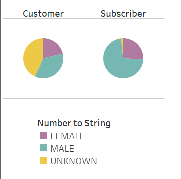
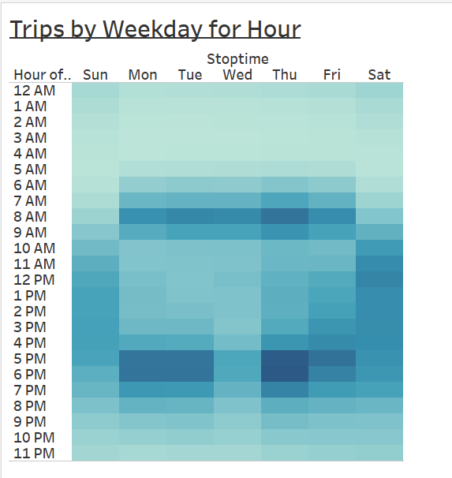
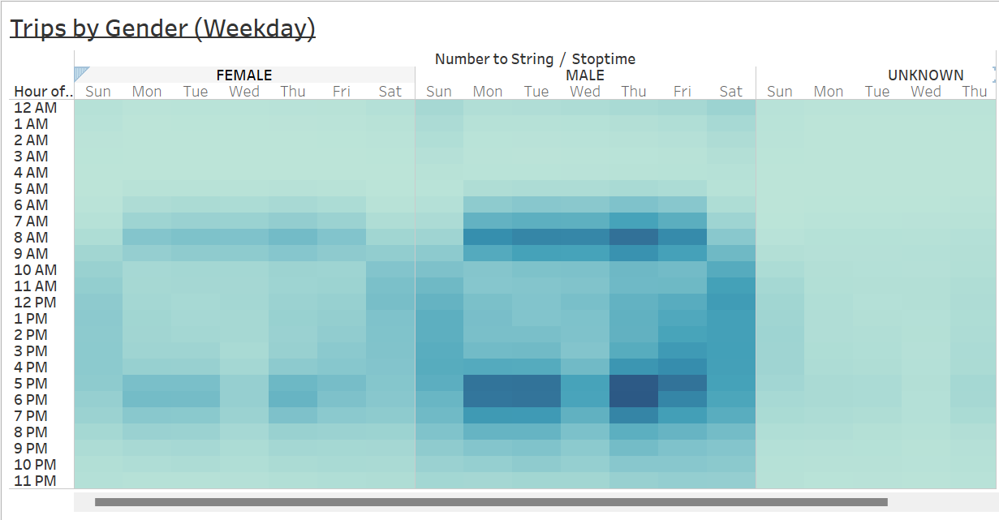
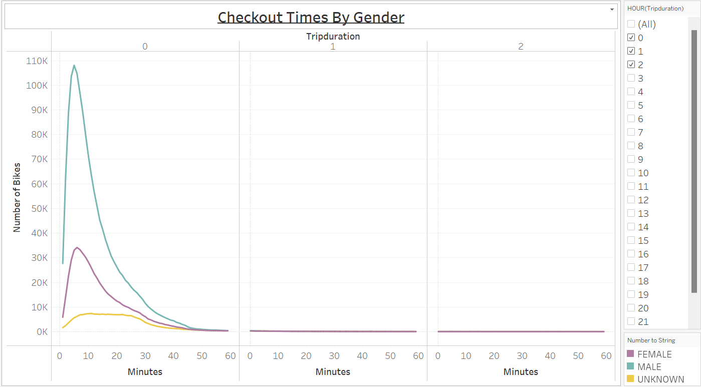
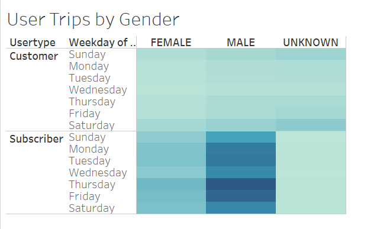

# NYC Citi Bike-sharing Analysis Overiew:
An Analysis was run on a bike-sharing program in New York City to see if it's a viable option to start up a bike-sharing
program in Des Moines, Iowa. This Analysis is based on data drawn from user type, gender, total trip duration, usage based on 
hours of the day and days of the week. The conclutions of the data will help to solidify the stakeholders investment. 

#### Resources:
- Jupyter Notebook
- Tableau

[Click here to view Tableau Presentation - NYC Citi Bike Analysis](https://public.tableau.com/app/profile/leiana.sulecki/viz/NYCCitiBikeChallenge_16543676394730/CItiBikeAnalysis "NYC Citi Bike Analysis")

## Analysis Results:

#### *Results: User Type based on Gender* 

This graph reflects the subscriber usage based on gender for a better understanding of the user demographic with far less 
uknowns. This also shows the primary users are male in both user types. 

 

#### *Results: Hourly usage based on Weekday*

#### Results (weekday breakdown of gender usage):
Here we see the graphs are nearly identical for male usage below and the weekday usage above. This again shows the primary user 
demographic.

#### Results based on trip duration (indentified by Gender):
This breakdown shows the ride time is far longer for male riders vs female/unknown riders. 

#### Results based on weekday usage (varying by gender/user type):
There are far more subscribing users with a heavy amount of male riders. We found on average there are 3x the male riders. 
Also reflected is the heaviest usage days for subscribers are Thursday and Friday, whereas the heaviest usage for customers
is Saturday and Sunday

## Analysis Summary: 

Our analysis shows that our primary demographic is **male**, with a high volume of usage during peak work commute times *Monday - Friday* 
(7-9am & 5-7pm). We can also deduce that tourism seems to play a larger role in weekend usage since thats where we see the highest volume 
of customer rides on *Saturday/Sunday* (10am to 7pm). In knowing our key demographic we can use this to analyize the city populations to 
determine viability of the program. 

#### Additional Visualizations:
- Analysis based on population/tourism in NYC compared to Des Moines, Iowa. This will help to gain a 
better understanding on usage and success of the program.
- Analysis of weather in both cities, running a side by side comparison with user results based on month.
- Analysis on distance of commute for subscribers, this will help to gauge the heaviest volume of usage and
if the two cities are similar.
